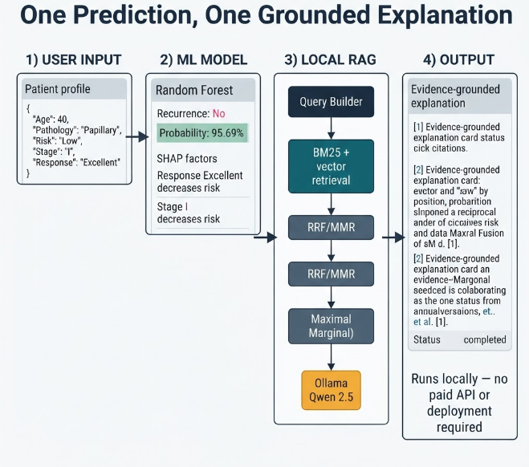
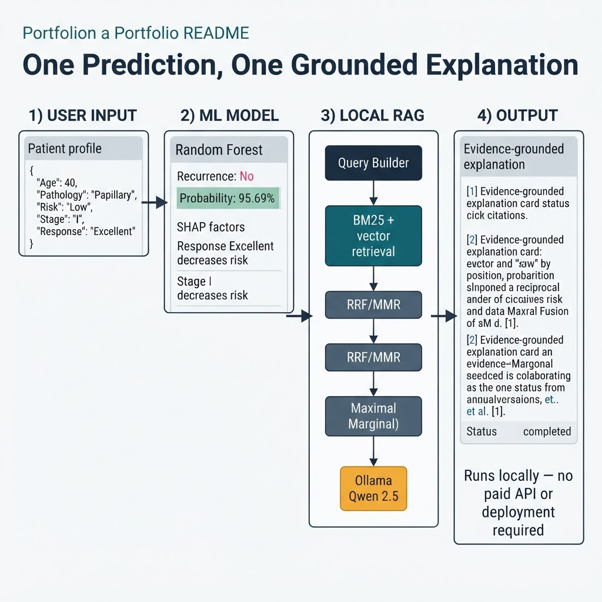
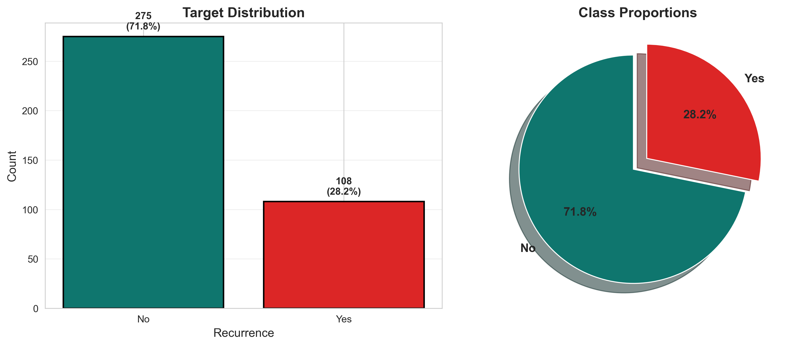
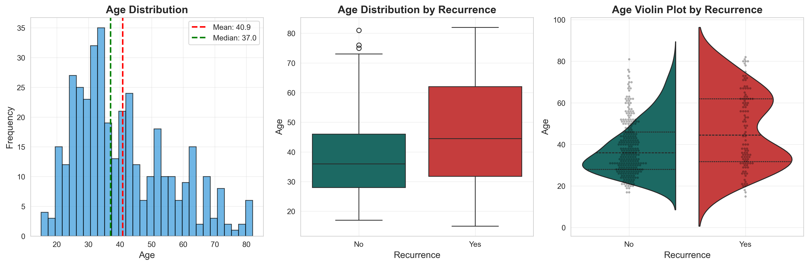
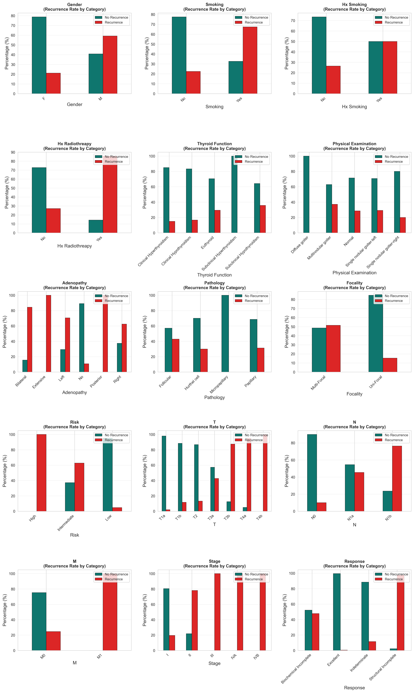
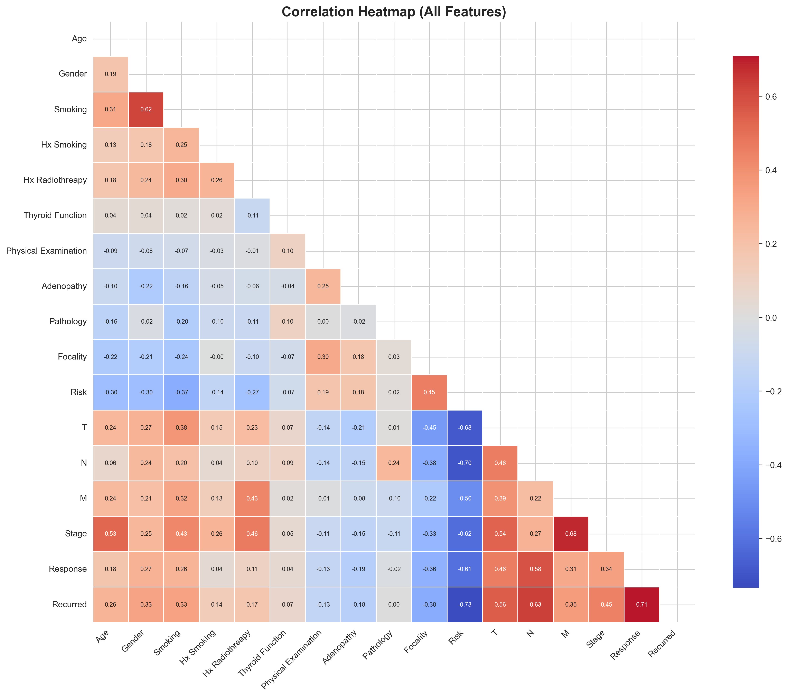
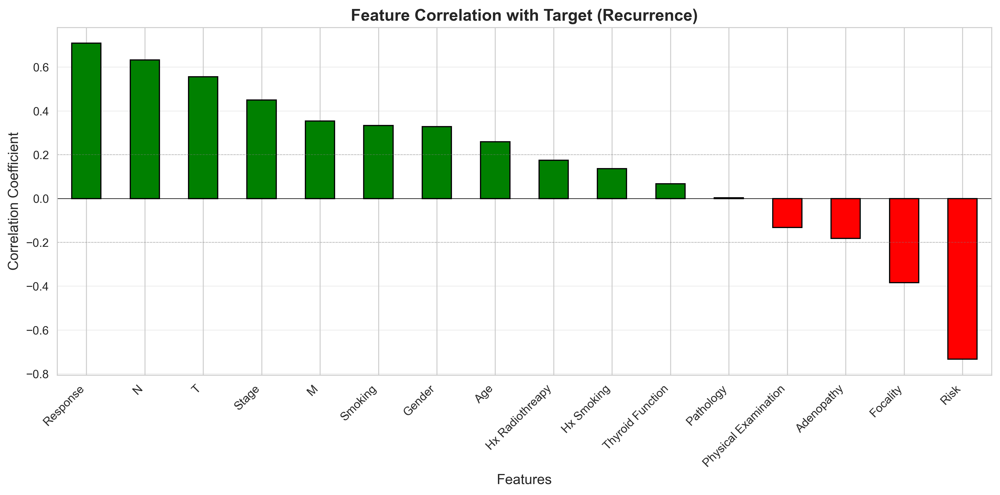
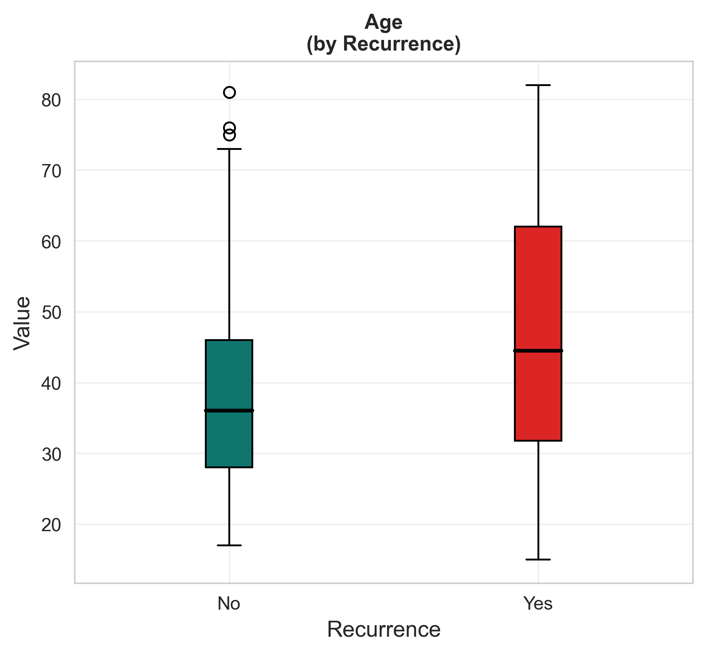

# ThyroidAI

## Explainable thyroid-cancer recurrence prediction with local, evidence-grounded RAG

ThyroidAI is a full-stack research and education platform for predicting recurrence of differentiated thyroid cancer and explaining the result. It combines a reproducible ML/DL benchmark, SHAP feature attribution, and an optional local RAG layer that retrieves context from PDFs supplied by the user and generates a grounded explanation with local Ollama/Qwen.

> **Safety:** ThyroidAI is not a certified clinical decision-support system. It does not diagnose, prescribe, or replace professional medical judgment. The RAG layer never overrides the prediction; it adds contextual evidence only when locally supplied documents are available.



## Example: input to grounded output

This is the practical flow when a user submits one patient profile. The prediction model runs first; the local RAG layer then uses the prediction and SHAP factors to retrieve relevant passages and produce a cited explanation. The example values below are illustrative documentation values, not a clinical conclusion.



### Prediction dashboard with RAG answer

The deployed-style dashboard below shows the complete user journey: the user enters clinicopathologic values, selects a model, receives the recurrence-risk prediction, and then reads the evidence-grounded RAG answer beside the result. In this project, the same flow can run locally without deploying the RAG service or paying for hosted AI infrastructure.


### What the user sees

1. **Input:** A patient profile is submitted to `POST /api/predict`.
2. **ML output:** The selected model returns a class, probability, confidence, and SHAP factors. For example: `No recurrence predicted` with `95.69%` probability.
3. **RAG context:** The frontend sends that result to `POST /api/rag/explain`. The query builder turns the highest-impact factors into retrieval queries, then combines BM25 and vector results with RRF and MMR.
4. **Final output:** Local Ollama/Qwen summarizes only the retrieved passages and returns a status, explanation, evidence chunks, query list, citations, and limitations.

A minimal request/response sequence looks like this:

```text
User profile
  -> /api/predict
  -> prediction + probability + SHAP factors
  -> /api/rag/explain
  -> retrieved evidence + local model
  -> grounded explanation + citations + limitations
```

This can be demonstrated entirely on a local machine. No hosted RAG deployment, paid vector database, paid embedding API, or paid LLM API is required; the trade-off is local disk, RAM, model-download time, and CPU/GPU inference time.

## Visual results gallery

The repository also includes reproducible exploratory-analysis outputs from the training workflow. These images make the ML results easier to inspect before running the dashboard or local RAG service.

### Dataset and model analysis

| Target distribution | Age analysis |
|---|---|
|  |  |

| Categorical feature analysis | Correlation heatmap |
|---|---|
|  |  |

| Features correlated with target | Top features by target |
|---|---|
|  |  |

These plots complement the end-to-end screenshots above: the dashboard shows the user-facing result, while the EDA artifacts show how the dataset and predictive signals were inspected during model development.

## What is included

- **Prediction dashboard** for patient-profile inference.
- **Model Bench** comparing Logistic Regression, Random Forest, SVM, KNN, Gradient Boosting, XGBoost, LightGBM, and a Keras ANN.
- **SHAP explainability** with risk-increasing and risk-decreasing factors.
- **Analytics dashboard** with recurrence distributions and clinicopathologic breakdowns.
- **Local RAG** exposed separately through `/api/rag/explain` so RAG failures cannot break `/api/predict`.
- **No paid AI services:** embeddings, retrieval, vector storage, and generation run locally.

## Architecture

```text
Patient profile
     |
     +--> /api/predict --> best trained model --> probability + SHAP factors
                                             |
                                             v
                                      /api/rag/explain
                                             |
          SHAP-aware query builder --> BM25 + vector retrieval --> RRF --> MMR
                                                                     |
                                                                     v
                                                        Ollama / Qwen 2.5 3B
                                                                     |
                                                                     v
                                               grounded explanation + evidence citations
```

### RAG lifecycle

1. Add real, legally accessible medical or educational PDFs under `backend/rag/documents/`.
2. Extract text with `pypdf`, detect sections heuristically, and create overlapping chunks.
3. Generate local embeddings with `BAAI/bge-small-en-v1.5` through `sentence-transformers`.
4. Persist vectors in ChromaDB and lexical terms in a BM25 index.
5. Build retrieval queries from the prediction and the highest-impact SHAP factors.
6. Fuse BM25 and vector rankings with reciprocal rank fusion (RRF), then diversify with maximal marginal relevance (MMR).
7. Ask local Ollama/Qwen to summarize only the retrieved context and return citations plus limitations.

RAG is intentionally additive: `/api/predict` retains its existing contract, while the frontend requests medical context only after a successful prediction.

## Repository layout

```text
frontend/
  src/app/                 Next.js pages: /, /predict, /explainability, /models, /analytics
  src/components/ui/       Radix/CVA shadcn-style components
  src/lib/                 API client and shared TypeScript types
backend/
  app/main.py              FastAPI app and router registration
  app/routers/api.py       Prediction, model, health, and analytics endpoints
  app/routers/rag.py       Separate RAG explanation endpoint
  app/core/model_loader.py Model artifacts, inference, and SHAP
  app/core/rag_engine.py  Retrieval and local generation orchestration
  app/core/ollama_client.py Ollama HTTP client
  app/schemas/             Pydantic API contracts
  ml_pipeline/train.py    Training, validation, evaluation, and artifact export
  rag/                     Chunking, embeddings, BM25, Chroma, fusion, ingestion, evaluation
  data/Thyroid_Diff.csv   UCI differentiated thyroid cancer recurrence data
  models/                  Generated model and metadata artifacts
docs/thyroidai-rag-pipeline.png

docker-compose.yml
```

## Technology

| Area | Stack |
|---|---|
| Frontend | Next.js 16, TypeScript, Tailwind CSS, Framer Motion, Recharts |
| Backend | FastAPI, Pydantic v2 |
| ML/DL | scikit-learn, XGBoost, LightGBM, TensorFlow/Keras |
| Explainability | SHAP permutation explainer |
| RAG | pypdf, sentence-transformers, ChromaDB, rank-bm25, manual RRF/MMR |
| Local generation | Ollama with `qwen2.5:3b` |

## Quick start

### 1. Train the prediction models

```bash
cd backend
python -m venv .venv
# macOS/Linux
source .venv/bin/activate
# Windows PowerShell: .venv\\Scripts\\Activate.ps1
pip install -r requirements.txt
python ml_pipeline/train.py
```

The training pipeline validates the dataset, imputes missing values, one-hot encodes categorical features, scales `Age`, trains eight candidates, evaluates stratified five-fold CV plus a held-out test split, and selects the winner by ROC-AUC, F1, then recall.

### 2. Start the backend

```bash
cd backend
cp .env.example .env
uvicorn app.main:app --reload --host 0.0.0.0 --port 8000
```

### 3. Start the frontend

```bash
cd frontend
npm install
npm run dev
```

Open [http://localhost:3000](http://localhost:3000). The API docs are available at [http://localhost:8000/docs](http://localhost:8000/docs).

Set `NEXT_PUBLIC_API_URL` in `frontend/.env.local` when the backend is not running at `http://localhost:8000`.

## Enable local RAG

Install [Ollama](https://ollama.com/download), then download the local model:

```bash
ollama pull qwen2.5:3b
```

Add genuine source PDFs first. See [`backend/rag/documents/README.md`](backend/rag/documents/README.md) for sourcing and folder conventions. The repository deliberately ships no fabricated clinical documents or citations.

```bash
cd backend
python -m rag.ingestion            # incremental ingestion
python -m rag.ingestion --rebuild  # rebuild Chroma and BM25 indexes
```

Default local configuration is in [`backend/.env.example`](backend/.env.example):

| Variable | Default | Purpose |
|---|---|---|
| `RAG_ENABLED` | `true` | Enable the RAG route and engine |
| `RAG_EMBEDDING_MODEL` | `BAAI/bge-small-en-v1.5` | Local embedding model |
| `LLM_PROVIDER` | `ollama` | Local generation provider |
| `LLM_MODEL` | `qwen2.5:3b` | Ollama model name |
| `OLLAMA_BASE_URL` | `http://localhost:11434` | Local Ollama endpoint |

If Ollama is unavailable or the index is empty, the endpoint returns a structured `rag_unavailable` or `no_evidence` response with limitations rather than a server error.

## API contracts

### Prediction

`POST /api/predict`

```json
{
  "Age": 40,
  "Gender": "F",
  "Smoking": "No",
  "Hx Smoking": "No",
  "Hx Radiothreapy": "No",
  "Thyroid Function": "Euthyroid",
  "Physical Examination": "Multinodular goiter",
  "Adenopathy": "No",
  "Pathology": "Papillary",
  "Focality": "Uni-Focal",
  "Risk": "Low",
  "T": "T1a",
  "N": "N0",
  "M": "M0",
  "Stage": "I",
  "Response": "Excellent"
}
```

The response includes `prediction`, class probabilities, confidence, model name, plain-language explanations, and `shap_factors`.

### RAG explanation

`POST /api/rag/explain`

```json
{
  "patient": {"Age": 40, "Pathology": "Papillary", "Risk": "Low", "Stage": "I", "Response": "Excellent"},
  "prediction": {"prediction": "No", "probability": 0.9569},
  "shap_factors": [{"feature": "Response", "value": "Excellent", "impact": -0.1442, "direction": "decreases"}]
}
```

A successful response contains `status`, `summary`, `clinical_context`, `evidence`, `retrieval_method`, `queries_used`, `limitations`, and a research disclaimer. Retrieval is reported as `BM25 + Vector + RRF + MMR`.

### Other endpoints

| Method | Endpoint | Purpose |
|---|---|---|
| GET | `/api/health` | Service and model status |
| GET | `/api/features` | Form fields and valid categorical values |
| GET | `/api/model-info` | Model comparison, ROC curves, confusion matrix |
| GET | `/api/analytics` | Dataset aggregates for the analytics page |
| GET | `/api/rag/status` | RAG availability and index status |

## Testing and evaluation

Run the retrieval evaluation after adding and labeling documents in `backend/rag/evaluate.py`:

```bash
cd backend
python -m rag.evaluate
```

The evaluator reports **Precision@K**, **Recall@K**, and **MRR** for retrieval. Its default expected-document lists are empty because the project cannot know which real PDFs you will supply; fill them with document identifiers from your own corpus before interpreting the scores.

Recommended smoke tests:

```bash
curl http://localhost:8000/api/health
curl http://localhost:8000/api/rag/status
curl -X POST http://localhost:8000/api/rag/status

# Prediction smoke test; use a complete profile accepted by /api/predict.
curl -X POST http://localhost:8000/api/predict \
  -H 'Content-Type: application/json' \
  -d '{"Age":40,"Gender":"F","Smoking":"No","Hx Smoking":"No","Hx Radiothreapy":"No","Thyroid Function":"Euthyroid","Physical Examination":"Multinodular goiter","Adenopathy":"No","Pathology":"Papillary","Focality":"Uni-Focal","Risk":"Low","T":"T1a","N":"N0","M":"M0","Stage":"I","Response":"Excellent"}'
```

The generated architecture image above is a visual end-to-end test artifact: it documents the boundary between prediction, SHAP query construction, hybrid retrieval, and local generation.

## Docker

```bash
docker compose up --build
```

- Frontend: `http://localhost:3000`
- Backend: `http://localhost:8000`
- API docs: `http://localhost:8000/docs`

The compose setup persists `backend/models`, `backend/data`, `backend/rag/documents`, and `backend/rag/vectorstore`. Ollama is expected to run on the host or as a separately managed service; the backend container is configured to reach host Ollama through `host.docker.internal`.

## Retraining and deployment

Replace `backend/data/Thyroid_Diff.csv` with a compatible 17-column dataset and rerun `python ml_pipeline/train.py`. The command regenerates preprocessing, metadata, metrics, ROC curves, and model artifacts; the frontend form derives its categorical options from metadata.

The frontend and backend are containerized and can be deployed independently to platforms such as Render, Railway, AWS ECS/App Runner, or Azure Container Apps. Set the deployed frontend's `NEXT_PUBLIC_API_URL` to the public FastAPI URL and provide persistent storage for model/RAG artifacts.

## Limitations and responsible use

- The dataset is small (383 patients), so metrics should not be treated as clinical validation.
- Results can shift between training runs, particularly for the stochastic ANN.
- SHAP uses a 50-sample permutation background and is explanatory, not causal.
- PDF section detection is heuristic and may be less accurate on dense two-column documents.
- CPU-only local generation can be slow.
- Evidence quality depends entirely on the PDFs supplied and indexed by the operator.
- The RAG layer summarizes retrieved context; it does not verify guideline currency or establish treatment recommendations.
- No authentication is implemented; this is a public demonstration.

Use only de-identified data, document sources you are legally permitted to process, and qualified clinical review for any real-world interpretation.

## Dataset attribution

The prediction system uses the UCI **Differentiated Thyroid Cancer Recurrence** dataset by Borzooei and Tarokhian (2023), containing 383 patients and 16 clinicopathologic features. Refer to the dataset license and original publication before redistributing derivative artifacts.

## License and contribution

This repository is intended for research, education, and portfolio demonstration. Before publishing a deployment, review dataset licensing, document redistribution rights, model governance, privacy controls, and your organization’s clinical-safety requirements.

Contributions should preserve the separation between `/api/predict` and `/api/rag/explain`, avoid fabricated evidence, and include reproducible evaluation notes for changes to retrieval or generation.
